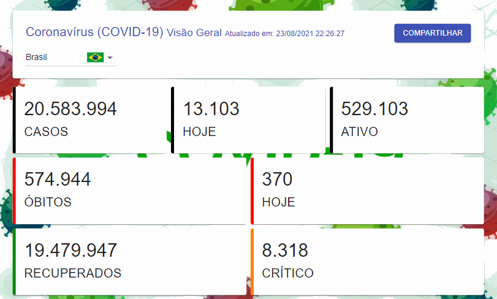

<h1 align="center">COVID-19 📊</h1>

<p align="center">
  <i>Progressive Web App em React com o panorama histórico da COVID-19 por país.</i>
</p>

<p align="center">
  <a href="https://covid19-pwa.netlify.app/"></a>
  <a href="https://github.com/lucasrmagalhaes/covid19-react/actions/workflows/ci.yml"></a>
  <a href="https://github.com/lucasrmagalhaes/covid19-react/blob/main/LICENSE"></a>
  <a href="https://github.com/lucasrmagalhaes/covid19-react/commits/main"></a>
</p>

<p align="center">
  <a href="https://covid19-pwa.netlify.app/">
    
  </a>
</p>

<p align="center">
  <strong>🔗 <a href="https://covid19-pwa.netlify.app/">covid19-pwa.netlify.app</a></strong>
</p>

## Sobre

Dashboard com o retrato histórico consolidado da COVID-19 — casos, casos por milhão, ativos, óbitos, letalidade, recuperados e críticos — consumindo a API pública [disease.sh](https://disease.sh/). A coleta global de dados foi encerrada em março de 2023; o painel indica a data real de corte da série.

- 🌎 **Todos os países** (~230) com busca, bandeiras e nomes localizados via `Intl.DisplayNames`
- 📈 **Gráfico da evolução da pandemia** por país e **ranking top 10** de casos por milhão (MUI X Charts)
- 🌙 **Modo claro/escuro** com um clique, integrado ao tema do Material UI
- 🌐 **Português e inglês** com um clique (i18n via Context próprio, sem dependências)
- 📱 **PWA**: instalável e funciona offline — o app shell e as respostas da API ficam em cache
- 📤 **Compartilhamento nativo** (Web Share API) no celular, cópia para a área de transferência no desktop

## Stack

React 19 · Vite · Material UI (@mui/material + MUI X Charts) · styled-components · vite-plugin-pwa

Qualidade: Vitest + Testing Library · ESLint 9 (flat config) + Prettier · CI no GitHub Actions · Dependabot

> Migrado em 2026 do create-react-app / React 16 / Material-UI v4 para a stack atual — detalhes no histórico de commits.

## Como rodar

```bash
npm install      # instala as dependências
npm run dev      # ambiente de desenvolvimento
npm run build    # build de produção (dist/)
npm run preview  # serve o build localmente
npm test         # roda a suíte de testes (Vitest)
npm run lint     # verifica o código (ESLint)
```

## Créditos

- [Projeto original](https://github.com/Tautorn/covid19-pwa) de Tautorn
- [disease.sh](https://disease.sh/) — Open Disease Data API
- [Flag Icons](https://www.softicons.com/web-icons/flag-icons-by-custom-icon-design) por Custom Icon Design

## Licença

Distribuído sob a licença MIT — veja [LICENSE](LICENSE).
